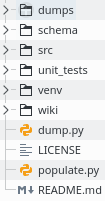

# DB populator 

###Directory structure  

 

* dumps - contains tables dumped in json files
* schema - contains slq script to create tables and json config to connect to MySQL  
* src - contains source code  
* unit_test - contains unit tests  
* venv - libraries
* wiki - documentation

### How to use?
- Create table script and save it schema/tables.sql
- Fill database connection configuration in schema/schema_info.json
- Fill json files corresponding to the sample.json to represent an sql table
- Executing ./populate.py will read the json files and populate tables in db
- Executing ./dump.py will read the tables and populate json files in "dumps" 
